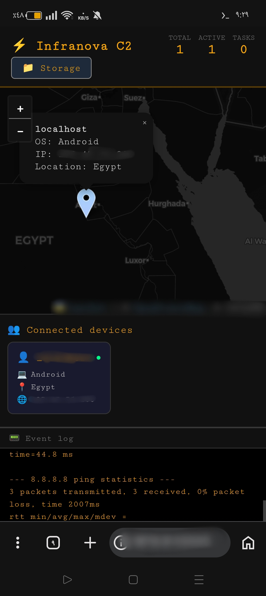
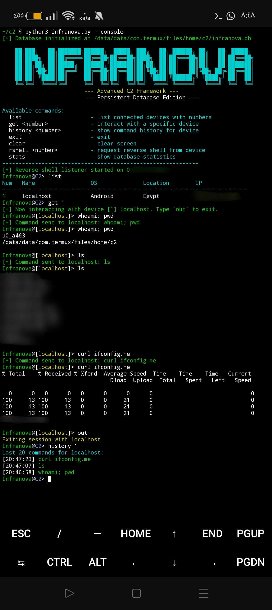
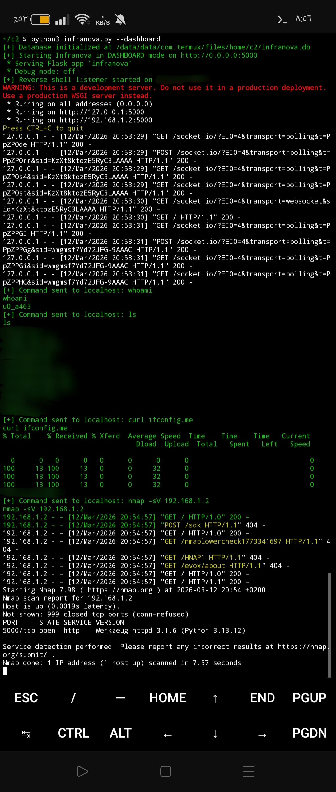

Infranova C2 Framework
​The Next Evolution of Hybrid Command & Control Infrastructure
​Infranova is a high-performance, closed-source architecture designed for complex remote orchestration and cognitive telemetry. Developed by Mr-SoniCTF, this framework leverages a decentralized relay mechanism to ensure maximum operational security and persistence across heterogeneous environments.

​🛡️ Tactical Specifications
​Omni-Platform Compatibility: Engineered for seamless execution on NT-based systems (Windows), POSIX-compliant environments (Linux), and Arm-based mobile runtimes (Android/Termux).
​Centralized Neural Dashboard: A sophisticated, real-time command interface featuring geospatial node mapping and low-latency data exfiltration streams.
​Advanced Evasion Logic: Utilizes proprietary tunneling protocols to achieve Firewall & IDS/IPS circumvention, maintaining a stealthy footprint within the target network.
​Persistent Data Integrity: Integrated with a localized, high-speed relational database for secure state management and Forensic Traceability.
​Low-Level Resource Management: Optimized kernel-space and user-space interaction for minimal CPU/RAM overhead during long-term deployment.

### 🖥️ Operational Showcase
*Deployment visuals and architectural overview:*

#### [01] Geospatial Node Intelligence

*Real-time spatial visualization of active synchronized nodes.*

#### [02] Interactive C2 Nexus (CLI)

*Encrypted interactive command-line interface for granular node manipulation.*

#### [03] Execution & Event Telemetry

*Live telemetry stream and backend architectural logs.*

​⚠️ Legal Mandate & Integrity
​This framework is strictly for Educational Research and Authorized Red Teaming only. Mr-SoniCTF holds no responsibility for unauthorized deployment or malicious misuse. Usage of Infranova implies adherence to global cybersecurity ethics.
​Lead Architect: Mr-SoniCTF
Origin: Cairo, Egypt. 🇪🇬
